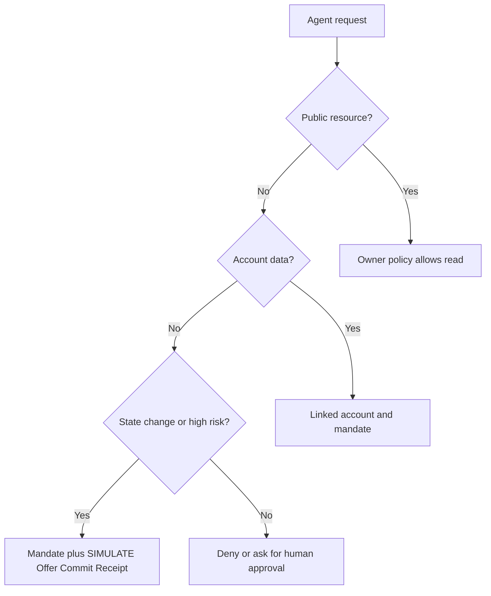

Read-only access is not one thing. A public product page and a private invoice
are both reads, but they require different authority.

This is the first rule to understand:

Public data can be exposed by owner policy. Account data requires user
authority. Consequential actions require stronger proof and receipts.

## Before Ajar

Many agent workflows use a browser session because it is the easiest way to get
past login. Once the session is available, the agent can often see everything
the user can see. That includes order history, saved addresses, invoices,
support tickets, carts, subscriptions, and account settings.

The problem is that the site cannot tell which parts the user meant to delegate.
The same session that can read an invoice might also change a profile, submit a
support message, cancel an order, or export data.

For public data, the opposite problem appears. Agents may fetch public pages,
but the owner has no clear way to say which agents are welcome, whether the
content can be trained on, whether requests are metered, or whether a public
price is authoritative.

## Ajar's access split

Ajar splits access into practical categories.

Public reads include pages such as documentation, blogs, product catalogs,
public prices, public availability, and other non-account-specific facts. The
owner can expose these to anonymous, signed, verified, allowlisted, or contracted
agents depending on policy.

Private reads include account-bound data such as orders, carts, invoices,
profile fields, saved addresses, support tickets, and user exports. These may be
read-only, but they still belong to a specific principal. Ajar expects a linked
account and delegated authority before an agent gets them.

Actions include anything that changes state or has consequences: cart updates,
holds, messages, purchases, cancellations, refunds, consent changes, exports,
and deletions. These use typed Actions and risk gates.

## What happens with login

Ajar does not need the model to hold the user's cookie.

The user logs in normally through the website's existing flow. The website then
binds that account to a principal key. The principal signs a mandate for a
specific agent key. When the agent calls the site, it sends a signed request and
the mandate. The Gateway checks the agent signature, account binding, mandate
scope, caps, expiry, and revocation.

That gives the site a clearer question to answer:

"Is this agent allowed to perform this specific action for this account under
this signed authority?"

That is much safer than:

"Does this request have a valid browser cookie?"

## Why this matters

The user can delegate a narrow job, such as "read my current cart and add this
item," without delegating the whole account. The owner can keep private areas
closed by default and only expose account data under explicit policy. The agent
gets a clear path that does not depend on brittle scraping or session sharing.

This also gives better failure behavior. If the mandate is missing, expired,
over scope, over cap, or revoked, the Gateway can fail closed with a clear Ajar
error instead of letting a model wander through account screens.
