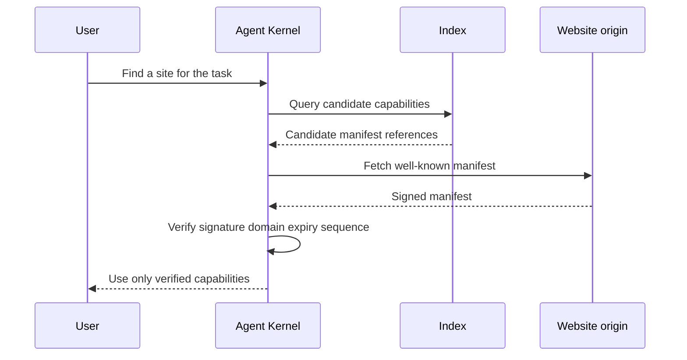

An agent needs a way to find websites that can answer a task. Search indexes and
directories are useful for that. They are not enough for trust.

Ajar separates discovery from verification. An index can suggest a site. The
agent still has to fetch the manifest from the origin and verify it before
relying on anything.

## Before Ajar

Without a signed site contract, an agent may depend on search results, scraped
pages, old cached data, undocumented APIs, or a tool description written outside
the website owner's control.

That creates several failure modes:

- A search result may be stale.
- A third-party directory may describe capabilities the site never approved.
- A malicious intermediary may point an agent at a fake action endpoint.
- A crawler may mix public content with private or personalized content.
- An agent may use a tool because it sounds right, not because the origin
  declared it.

In normal browsing, a human can often notice a suspicious site or broken flow.
An agent needs a protocol-level check.

## The Ajar verification path

Ajar starts from the origin domain.

The conforming site publishes its Capability Manifest at
`/.well-known/ajar.json`. The manifest is signed by the owner key. The owner key
must be bound to the domain according to the protocol's discovery and identity
rules.

When an agent finds a candidate site, it should:

1. Fetch the manifest from the origin domain.
2. Verify the owner signature.
3. Check the domain binding.
4. Check expiry and manifest lifetime.
5. Check sequence or rollback protection.
6. If the site uses transparency logs, check the relevant log proof.
7. Only then treat the Views, Actions, policy, pricing, and keys as usable.

The important point: the index never becomes the authority. It only helps the
agent find candidates.

## What this resolves

Discovery is allowed to be broad. Verification is strict.

That means Ajar can support many discovery paths: a public index, a search
engine, a link in HTML, a known site URL, an enterprise allowlist, or a local
registry. They all lead back to the same verification step.

This protects website owners from unauthorized capability claims. It protects
agents from fake manifests and stale action descriptions. It also gives
implementers a simple rule: never execute consequential work from a discovery
record alone.

## Why manifests expire

A manifest is a contract for a period of time. If it never expired, old policy
could live forever in caches. Ajar requires expiry and sequence checks so agents
do not rely on a rollback or stale declaration.

This is especially important for actions. An owner may disable checkout, raise a
risk gate, revoke an operational key, change pricing, or remove a route. Agents
must refresh and verify before acting.

## How this fits with public search

The future index can make Ajar useful at web scale. A user can ask for a site
that sells refundable train tickets, exposes catalog search, accepts a settlement
adapter, and supports a purchase action under a mandate. The index can return
candidate manifests.

But the Kernel still fetches each manifest from the origin and verifies it. That
keeps search useful without making search trusted.
