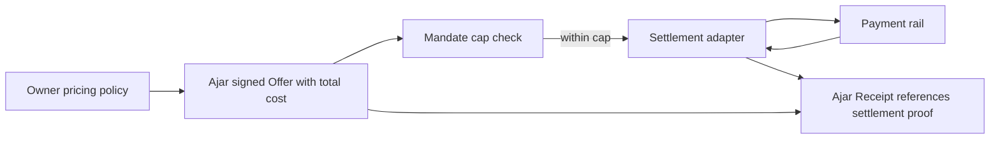

Agent traffic costs money. It can also create revenue. Ajar treats economics as
part of the owner contract instead of leaving it as an afterthought.

The important boundary is this: Ajar declares pricing, metering, offers, and
settlement adapters. It does not become the payment rail.

## Before Ajar

Many sites see automated traffic as cost without attribution. Agents fetch heavy
HTML, trigger search pages, hit APIs indirectly, and consume infrastructure.
Owners can block, rate limit, or negotiate private deals, but they often cannot
publish a simple machine-readable rule such as:

- public docs are free,
- commercial crawl reads cost this much,
- catalog search is free,
- purchase actions settle through this rail,
- simulate calls are free or separately metered,
- the signed offer is the authoritative price.

For actions, pricing can be even harder. A page may show one price, checkout may
add tax and fees, inventory may change, and a payment provider may settle later.
The agent needs to know which number is advisory and which number is binding.

## What Ajar provides

Ajar's manifest can declare metering and accepted settlement adapters. A 402
response or action response can include an advisory price. For action execution,
the signed Offer's total cost is authoritative.

That means the Kernel can compare the actual resolved cost against the mandate
caps before commit. If the total cost exceeds the cap, the commit should not
happen.

Ajar can work with settlement systems such as x402, AP2-card, MPP, or vendor
adapters. The settlement proof references the Ajar receipt. The payment rail
moves money; Ajar binds the payment-related action to mandate, offer, commit,
and receipt.

## Why this is useful

Owners get a way to state economics in the same place they state access policy.
Agents get a way to discover cost before they act. Users and organizations get
cap checks before money is spent.

This also helps separate read economics from action economics. A site might
charge for high-volume reads, expose public docs for free, and only settle money
when a purchase commit succeeds. Ajar can express those choices without forcing
one business model.

## What Ajar deliberately does not do

Ajar does not replace checkout, card networks, stablecoin payment protocols,
bank rails, PSPs, or merchant systems. It composes with them.

That boundary keeps the protocol smaller. Ajar answers: was this action declared
by the owner, authorized by the principal, accepted by the agent, and executed
under signed terms? The settlement adapter answers: how did the money move?

The two records meet at the receipt.
