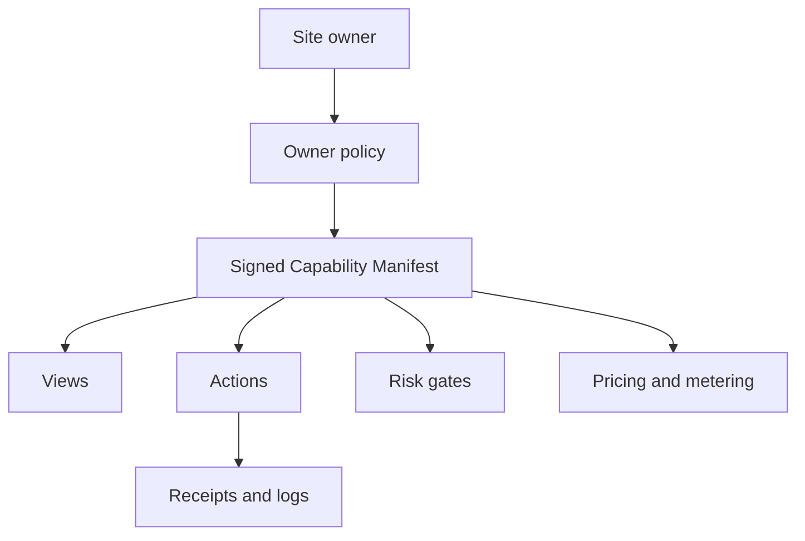

Ajar is owner-controlled. That matters because a website owner is the only party
that can safely decide what the site should expose to agents.

Without Ajar, an agent usually sees the same surface a human sees: HTML,
scripts, forms, and maybe an API discovered by reverse engineering. The website
has no standard way to say, "this catalog is public," "this checkout action is
allowed only for verified agents," "this route is never exposed," or "this
action requires a user mandate."

The owner contract is the answer to that gap.

## Before Ajar

The site owner has scattered controls:

- `robots.txt` may say something about crawling, but not about actions.
- HTML may contain schema markup, but not a complete access policy.
- A login wall protects account data, but it does not express delegated access.
- Rate limits and bot rules can slow traffic, but they do not describe what is
  safe.
- Payment or checkout systems know how to charge, but not how to prove agent
  authority for every non-payment action.

This leaves agent access implicit. Agents infer. Owners react. Users hope the
agent stays inside what they intended.

## What the contract contains

The Ajar contract starts with the signed Capability Manifest at
`/.well-known/ajar.json`.

The manifest declares the site's identity, owner key, supported protocol
version, content Views, Actions, policy summary, pricing or metering, and
operational keys. The exact details are in the protocol spec. The concept is
simple: the owner signs what agents are allowed to rely on.

A manifest is not just a directory. It is a boundary. If an action is not
declared, the agent should not treat it as a normal Ajar action. If a resource is
not exposed by policy, the agent should not assume that scraping it is welcome.
If a risk gate says mandate or human approval is required, the agent cannot skip
that gate by asking the model nicely.

## Why signing matters

A signed manifest gives agents something verifiable. The agent can check that
the manifest came from the domain owner and has not expired or rolled back to an
older policy.

That protects the owner too. If a fake index or intermediary tells an agent that
a site accepts a risky action, the agent must still fetch and verify the
manifest from the origin. The index helps discovery; it does not become the
source of truth.

## How this resolves the owner problem

With Ajar, the owner can say:

- what public content agents may read,
- what content stays hidden,
- which actions exist,
- who may call them,
- what risk class they carry,
- what each call costs,
- what mandate scopes are required,
- when human approval is needed,
- how receipts and logs are retained.

The owner does not have to expose everything. A fresh install can expose
nothing. A cautious owner can start with public read-only Views. A commerce site
can expose catalog search first, then cart updates, then checkout under stricter
gates.

Ajar's resolution is not "let agents in." It is "let owners publish the rules,
sign them, and enforce them consistently."
