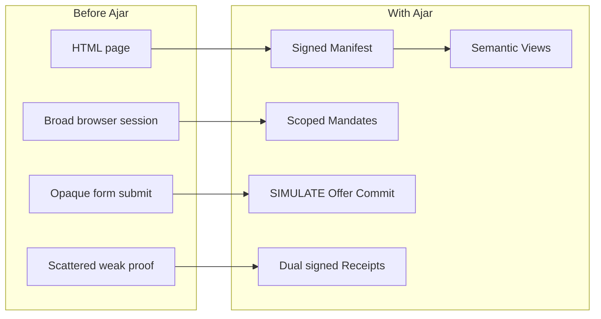

AI agents can already use websites. They can open a browser, read visible text,
click buttons, submit forms, and carry a logged-in session. That is useful for
demos, but it is not a good foundation for real access.

The web page was designed for a person looking at a screen. It was not designed
to tell an agent which facts are canonical, which routes are private, which form
submission mutates state, which action costs money, or who approved the action.
The result is a fragile arrangement where the agent guesses and the website
hopes the guess is harmless.

## What goes wrong today

Agents scrape HTML and treat it as source-of-truth data. That fails when the
page is client-rendered, localized, stale, personalized, hidden behind scripts,
or shaped by an A/B test. The agent may extract the wrong price, miss a warning,
or confuse decorative content with a real product field.

Agents also use sessions that were meant for humans. A browser cookie usually
opens the entire account surface. If the model has access to that session, the
site cannot easily tell whether the user meant to allow a public search, an
order lookup, a cart change, a purchase, or a data export. Everything looks like
the same logged-in user.

Website owners get a bad deal too. They can block bots, allow bots, rate limit
traffic, or hide behind login. None of those choices are a clean policy. They do
not say which agent operators are trusted, what public content is open, what
private content needs user authority, which actions exist, or what proof should
remain after an action.

The weakest part is accountability. If an agent buys the wrong item, sends a
message, deletes data, or exports personal information, both sides need evidence:
what did the site declare, what did the user authorize, what did the site predict
would happen, what was committed, and what actually executed? Normal web
automation does not leave that trail.

## What Ajar changes

Ajar gives the website an explicit agent-facing contract.

The site owner publishes a signed Capability Manifest. It says what semantic
Views exist, which typed Actions exist, what risk class each action carries, who
may call them, what pricing or metering applies, and which gates must be passed
before execution.

The agent does not blindly trust a page or an index. It fetches the manifest from
the origin, verifies the owner signature, and then treats the manifest as the
site's declared contract.

For content, Ajar adds semantic Views. Agents no longer have to guess meaning
from the visible page alone. The site can expose structured, signed
representations of the same resources humans see in HTML.

For authority, Ajar uses mandates. A principal signs a narrow delegation for a
specific agent key, with scopes, caps, domains, expiry, and revocation. The model
can propose work, but the Kernel and Gateway check the mandate before anything
consequential happens.

For actions, Ajar uses risk classes and rehearsal. Risky actions must simulate
first, then become a signed Offer, then be committed under a valid mandate. Both
sides keep the Receipt.

The goal is not to make every website fully automatic. The goal is to replace
guessing with signed declarations and narrow authority.
