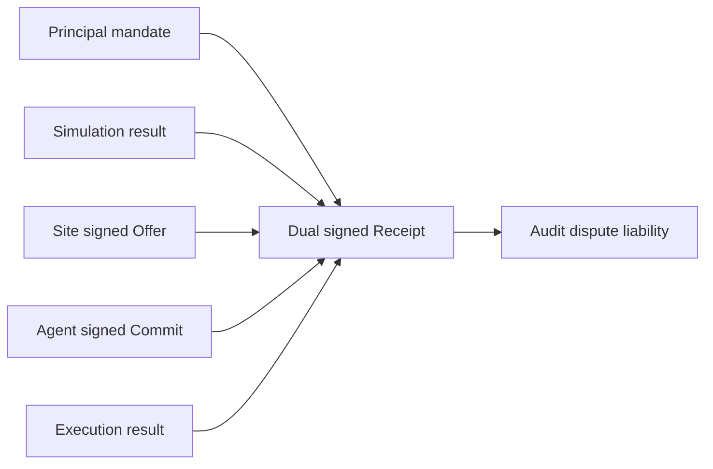

Consequential agent actions need evidence. If something goes wrong, it should be
possible to answer what the site declared, what the user authorized, what the
agent committed, and what the site executed.

Ajar receipts are designed for that.

## Before Ajar

Normal web automation leaves scattered logs. The browser may have history. The
server may have request logs. A payment provider may have a charge id. The user
may have a confirmation email. The agent may have a transcript.

Those artifacts are useful, but they are not the same as a shared signed record.
They may not bind the user's delegation to the final action. They may not record
the simulation result or the offer that was accepted. They may not prove which
agent key acted.

In a dispute, each side may hold a different partial story.

## What Ajar records

An Ajar Receipt is a dual-signed record. It binds the offer, the mandate hash,
the result summary, execution time, site signature, and agent signature.

The site keeps a copy according to owner policy. The Kernel keeps a copy in its
Receipt Vault. That means the site cannot silently rewrite history, and the
agent cannot deny the commit it signed.

Receipts do not make mistakes impossible. They make consequential actions
attributable.

## Liability becomes more mechanical

Ajar's liability model follows the signed trail.

If the action was outside the mandate scope or caps, the agent operator is
exposed because the signatures show overreach.

If the action was inside the mandate and the principal later regrets it, the
principal signed the authority.

If the site misclassified risk, materially changed terms after simulation, or
failed to verify a required mandate, the site is exposed because its own signed
declarations and receipts show the failure.

That is the point of receipts: not paperwork for its own sake, but a way to
remove ambiguity from high-stakes automation.

## Why this matters for adoption

Businesses will not let agents act widely without audit trails. Finance,
commerce, support, healthcare, logistics, and compliance workflows all need a
record of who authorized what.

Ajar gives owners and agent operators a common artifact to retain. That makes
agent actions easier to review, dispute, reimburse, monitor, and eventually
insure.

The receipt is the memory of the protocol. Without it, Ajar would only be an
access layer. With it, Ajar becomes an accountability layer too.
